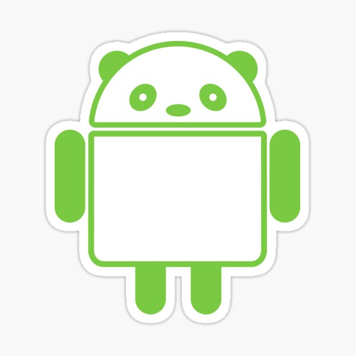

<h1 align="center">Android's dotfiles</h1>

    

## Introduction

I began my mobile journey with the [Sony Ericsson K800i](https://en.wikipedia.org/wiki/Sony_Ericsson_K800i),
followed by the [Nokia N96](https://en.wikipedia.org/wiki/Nokia_N96), and eventually transitioned
to the world of smartphones.

[Xperia X10](https://en.wikipedia.org/wiki/Sony_Ericsson_Xperia_X10) was my first Android phone, the experience was terrible.
I was a teenager and I want to run multiple applications with my phone and comparable to my friends iPhone it was socks.
Then I bought [Xperia Z](https://en.wikipedia.org/wiki/Sony_Xperia_Z) before going into the iOS world.

Then I had iPhone 3g, after that I bought iPhone 4 and continue with it until I bought iPhone 5s, iPhone 6s and iPhone 7.
After having these multiple models of iPhone, I finally decide to back with android, so I bought [Samsung Galaxy S9](https://en.wikipedia.org/wiki/Samsung_Galaxy_S9).
After a while I bought [Samsung Galaxy S21](https://en.wikipedia.org/wiki/Samsung_Galaxy_S21), [Nothing Phone (1)](https://en.wikipedia.org/wiki/Nothing_Phone_1)
and now I have [Nothing Phone (2a)](https://en.wikipedia.org/wiki/Nothing_Phone_2a)

The experience with Android so far is better than iOS, and it has more free and open source applications.
Nothing Phone (1) / Noting Phone (2a) is also comparable to its price is awesome. Nothing Phone also supports 5G in my homeland.

## Applications

- [**MyKet**](https://myket.ir/)
- [**Play Store**](https://play.google.com/)
- [**F-Droid**](https://f-droid.org/)
- [**Farsroid**](https://www.farsroid.com/)

|                Application                | Description                                                                                                                                                                                                                                               | Sources                                                                                                                                                 |
| :---------------------------------------: | :-------------------------------------------------------------------------------------------------------------------------------------------------------------------------------------------------------------------------------------------------------- | :------------------------------------------------------------------------------------------------------------------------------------------------------ |
|          Android Password Store           | An open-source password manager that securely stores and manages passwords using GPG encryption. (based on [`gopass`](https://github.com/gopasspw/))                                                                                                      | [GitHub](https://github.com/android-password-store/Android-Password-Store)                                                                              |
| [Syncthing](https://github.com/syncthing) | An open-source, peer-to-peer file synchronization tool that syncs files between devices without a central server.                                                                                                                                         | [F-Droid](https://f-droid.org/en/packages/com.nutomic.syncthingandroid/)                                                                                |
|                   DAVx                    | An open-source CalDAV/CardDAV client for Android that syncs contacts, calendars, and tasks with your server.                                                                                                                                              | [F-Droid](https://f-droid.org/en/packages/at.bitfire.davdroid/)                                                                                         |
|                    VLC                    | Video player                                                                                                                                                                                                                                              | [F-Droid](https://f-droid.org/en/packages/org.videolan.vlc/)                                                                                            |
|                    MPV                    | Video player                                                                                                                                                                                                                                              | [F-Droid](https://f-droid.org/en/packages/is.xyz.mpv/)                                                                                                  |
|              PersianCalendar              | An android app that provides a comprehensive Persian (Jalali) calendar with features like date conversion, events, and holidays.                                                                                                                          | [F-Droid](https://f-droid.org/en/packages/com.byagowi.persiancalendar/)                                                                                 |
|               Telegram FOSS               | Open-source telegram client                                                                                                                                                                                                                               | [F-Droid](https://f-droid.org/en/packages/org.telegram.messenger/), [GitHub](https://github.com/Telegram-FOSS-Team/Telegram-FOSS)                       |
|                   Xodo                    | A feature-rich PDF reader and editor for Android that allows users to view, annotate, and manage PDF documents.                                                                                                                                           | [Farsroid](https://www.farsroid.com/xodo-pdf-reader-annotator/)                                                                                         |
|         Advanced Download Manager         | An Android Download manager                                                                                                                                                                                                                               | [Farsroid](https://www.farsroid.com/advanced-download-manager-pro/)                                                                                     |
|             RetroMusicPlayer              | An open-source music player for Android with a sleek, Material Design interface, offering features like custom themes and advanced playback controls                                                                                                      | [Play Store](https://play.google.com/store/apps/details?id=code.name.monkey.retromusic), [GitHub](https://github.com/RetroMusicPlayer/RetroMusicPlayer) |
|              Material Files               | File manager                                                                                                                                                                                                                                              | [F-Droid](https://f-droid.org/en/packages/me.zhanghai.android.files/)                                                                                   |
|           PicsArt Photo Studio            | Photo editor                                                                                                                                                                                                                                              | [Farsroid](https://www.farsroid.com/picsart-photo-studio/)                                                                                              |
|          Polish Photo Editor Pro          | Photo editor                                                                                                                                                                                                                                              | [Farsroid](https://www.farsroid.com/photo-editor-pro-polish/)                                                                                           |
|                Aves Libre                 | Image Gallery and metadata explorer                                                                                                                                                                                                                       | [F-Droid](https://f-droid.org/packages/deckers.thibault.aves.libre/)                                                                                    |
|                  Discord                  | A popular communication platform for Android that allows users to chat, voice call, and video call, primarily used by gamers and communities.                                                                                                             | [Play Store](https://play.google.com/store/apps/details?id=com.discord)                                                                                 |
|              Firefox Nightly              | The experimental version of the Firefox browser for Android, featuring the latest updates and innovations before they reach the stable release.                                                                                                           | [Play Store](https://play.google.com/store/apps/details?id=org.mozilla.fenix) / MyKet                                                                   |
|               Firefox Focus               | A privacy-focused mobile browser for Android that automatically blocks trackers and erases browsing history for enhanced privacy.                                                                                                                         | [Play Store](https://play.google.com/store/apps/details?id=org.mozilla.focus) / MyKet                                                                   |
|                   Bale                    | A messaging app developed by an Iranian company, offering features like text messaging, voice and video calls, and file sharing.                                                                                                                          | [MyKet](https://myket.ir/app/ir.nasim)                                                                                                                  |
|                   Squid                   | A note-taking app for Android that allows users to write, draw, and markup documents using a stylus or finger, mimicking the experience of writing on paper.                                                                                              | [Farsroid](https://www.farsroid.com/squid-premium-formerly-papyrus/)                                                                                    |
|                   Skype                   | A communication app for Android that offers free voice and video calls, messaging, and file sharing, enabling users to connect with others worldwide.                                                                                                     | [Play Store](https://play.google.com/store/apps/details?id=com.skype.raider)                                                                            |
|                  Neshan                   | An Iranian-developed navigation and map application for Android, providing detailed maps, turn-by-turn directions, and location-based services within Iran.                                                                                               | [MyKet](https://myket.ir/app/org.rajman.neshan.traffic.tehran.navigator)                                                                                |
|             Nothing Icon Pack             | Nothing Icon Pack in our monochrome color scheme.                                                                                                                                                                                                         | [Play Store](https://play.google.com/store/apps/details?id=com.nothing.icon)                                                                            |
|               Noor Aljinan                |                                                                                                                                                                                                                                                           | [Play Store](https://play.google.com/store/apps/details?id=org.crcis.mafatih), MyKet                                                                    |
|                   Quran                   | An Android app designed for reading and studying the Quran, offering features like translation, recitation, and bookmarking.                                                                                                                              | [Play Store](https://play.google.com/store/apps/details?id=org.crcis.quran), [MyKet](https://myket.ir/app/org.crcis.quran)                              |
|             Microsoft Outlook             |                                                                                                                                                                                                                                                           | [Play Store](https://play.google.com/store/apps/details?id=com.microsoft.office.outlook)                                                                |
|                 K-9 Mail                  | K-9 Mail is an open source email client focused on making it easy to chew through large volumes of email.                                                                                                                                                 | [F-Droid](https://f-droid.org/packages/com.fsck.k9/)                                                                                                    |
|                   DMSS                    | DMSS (Digital Mobile Surveillance System) is an Android application designed for remote surveillance and management of security cameras and other surveillance devices. It is typically used in conjunction with Dahua Technology's surveillance systems. | [Play Store](https://play.google.com/store/apps/details?id=com.mm.android.DMSS)                                                                         |
|                 NeoStore                  | An F-Droid client with modern UI and an arsenal of extra features.                                                                                                                                                                                        | [GitHub](https://github.com/NeoApplications/Neo-Store), [F-Droid](https://f-droid.org/packages/com.machiav3lli.fdroid/)                                 |
|                  GitHub                   | Let’s build together on the go                                                                                                                                                                                                                            | [Play Store](https://play.google.com/store/apps/details?id=com.github.android)                                                                          |
|                 Obsidian                  | Obsidian is the private and flexible writing app that adapts to the way you think.                                                                                                                                                                        | [GitHub](https://github.com/obsidianmd/obsidian-releases/)                                                                                              |
|                Textra SMS                 | A beautiful, super-fast, feature rich SMS & MMS app.                                                                                                                                                                                                      | [Farsdroid](https://www.farsroid.com/textra-sms/)                                                                                                       |

## Screenshots

    
    
    
    

